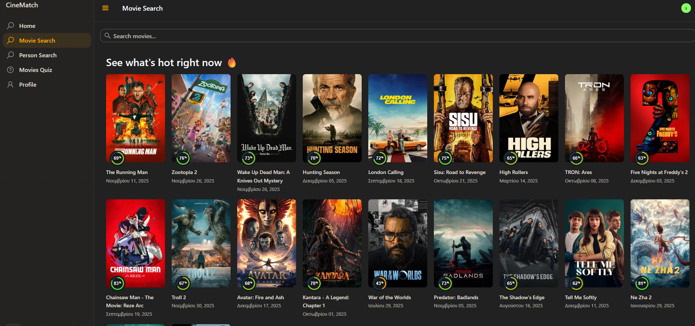
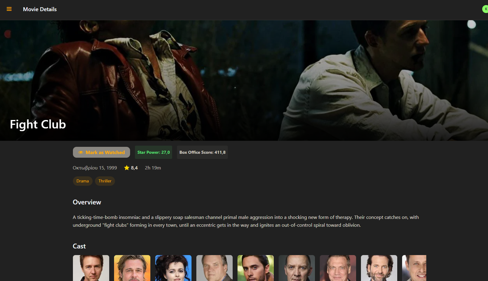
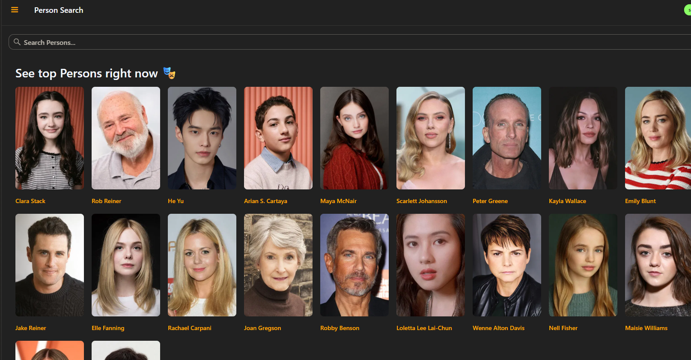
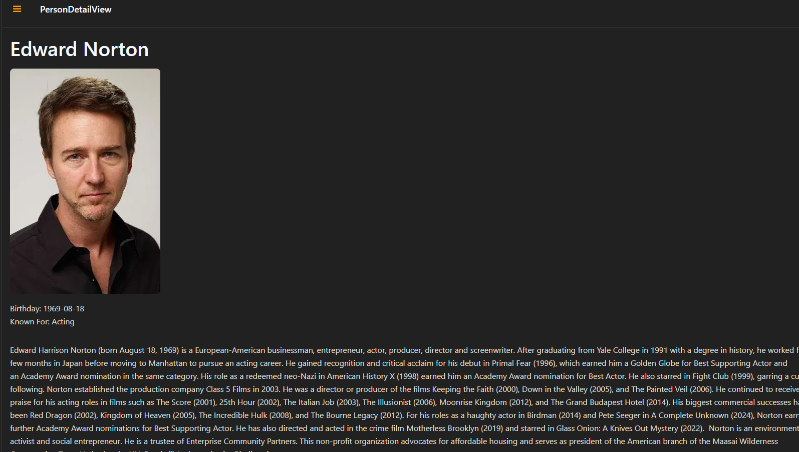
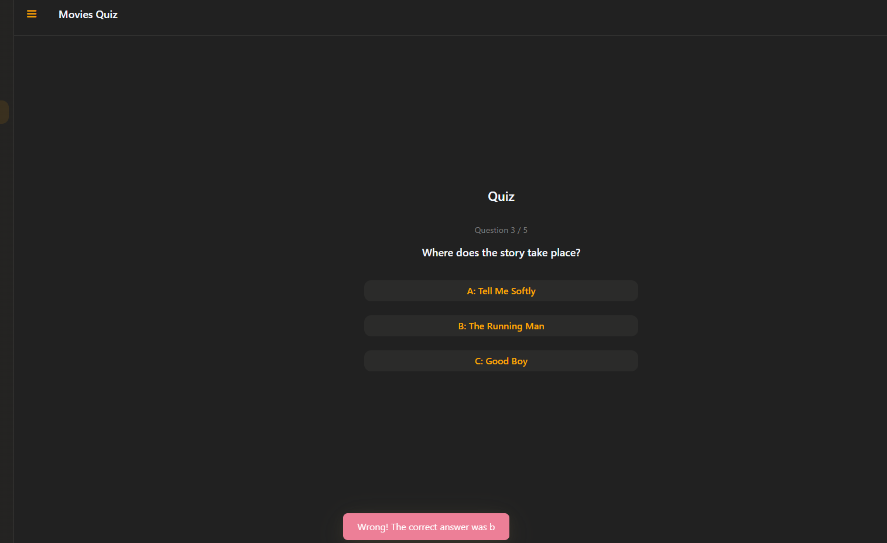
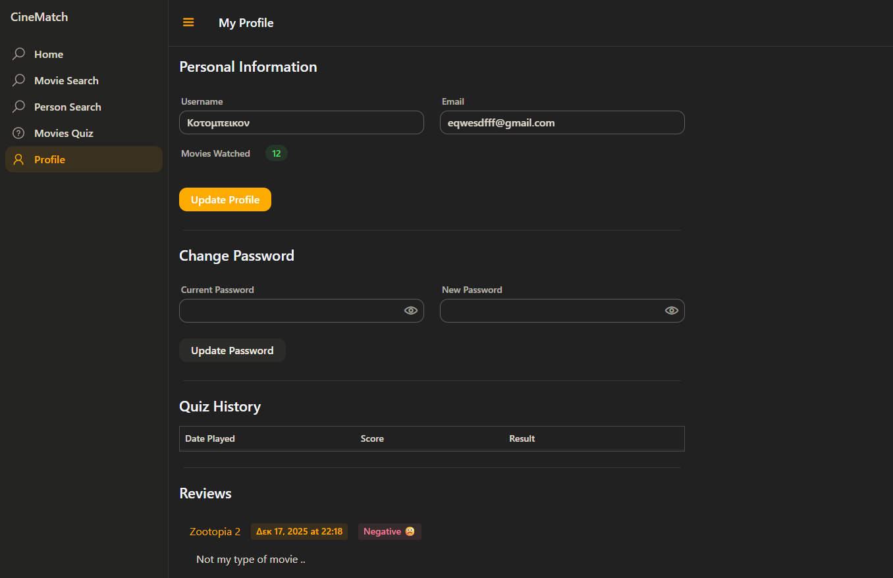

#  Cinematch

---
>Η κινηματογραφική σου βιβλιοθήκη, σε μία εφαρμογή.

To **Cinematch** είναι μια εφαρμογή γραμμένη στην **Java**, σχεδιασμένη για να προσφέρει μια ολοκληρωμένη εμπειρία ενημέρωσης και ψυχαγωγίας γύρω από τον κόσμο του σινεμά.

---
# Λειτουργίες

### Διαχείρηση λογαριασμού
* **Login Panel:** Ασφαλής σύνδεση και ταυτοποίηση χρήστη.
* **Διαχείριση Προφίλ:** Δυνατότητα αλλαγής **Username**, **Password** και **Email**.
* **Favorite Movies:** Προσθήκη και διαχείριση της προσωπικής σας λίστας αγαπημένων ταινιών.

###  Ανακάλυψη Περιεχομένου
* **Trending Movies:** Άμεση ενημέρωση για τις πιο δημοφιλείς ταινίες της εποχής.
* **Person Search:** Αναζήτηση πληροφοριών για **Ηθοποιούς** και **Σκηνοθέτες**.

### Ψυχαγωγία
* **Quiz Games:** Τεστ γνώσεων για να αποδείξετε πόσο καλά γνωρίζετε τις αγαπήμενες σας ταινίες.

---
# Προϋπόθεσεις

### Για να τρέξετε την εφαρμογή θα πρεπει να έχετε την εφαρμογή **Docker** εγκαστεστημένη στον υπολογιστή σας.

---

# Screenshots

  
 Κάντε Κλίκ για να δείτε τα Screenshots της Εφαρμογής.

### Movie Search

### Movie Details

### Person Search

### Person Details

### Quiz

### Profile Panel

---
#  Project Manager
* [@nikosxrist](https://github.com/nikosxrist)
#  Συμμετέχοντες
* [@Far0yk](https://github.com/Far0yk)

* [@EvriZapt](https://github.com/EvriZapt)

* [@drmqwerty](https://github.com/drmqwerty)

* [@ThodorisT30](https://github.com/ThodorisT30)

* [@kobas2310](https://github.com/kobas2310)